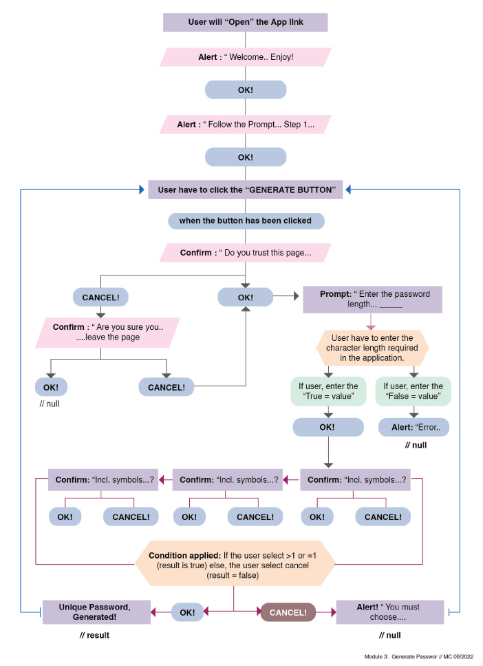

# Module 3 | Javascript : Generator Password

## Description

Create a functional javascript to generate a unique password. Html & Css were already given for this assignment. 

## Here's the following criteria given on this assignment [For reference only:]

```
GIVEN I need a new, secure password
WHEN I click the button to generate a password
THEN I am presented with a series of prompts for password criteria
WHEN prompted for password criteria
THEN I select which criteria to include in the password
WHEN prompted for the length of the password
THEN I choose a length of at least 8 characters and no more than 128 characters
WHEN asked for character types to include in the password
THEN I confirm whether or not to include lowercase, uppercase, numeric, and/or special characters
WHEN I answer each prompt
THEN my input should be validated and at least one character type should be selected
WHEN all prompts are answered
THEN a password is generated that matches the selected criteria
WHEN the password is generated
THEN the password is either displayed in an alert or written to the page
```

## Challenges:

> As a student, and having zero background in computer science + I'm not a programmer, I'm a designer 😅. You will definitely feel lost at first. Specially on our first session of "Javascript", you will have this kind of expression "what the heck I am doing". But hey, "We're living in the modern world, lots of resources to back-up our zero knowledge, the only solution if you'll put an effort into it and just keep going ("Grit")..

## What do I have to learn more, in terms of Javascript:
>
> * Data Structure (reference)
> * Algorithms (reference)
> * and more.... 
>

## Please see the basic flowchart of my password generator and functionality:




## Defining and Designing the script: was included inside my javascript using //comments..

- - -
Credit: to my tutor who helped me to finish the missing function and to understand the additional arguments and other built-in functions. Thanks to **Sam&James** as well..
